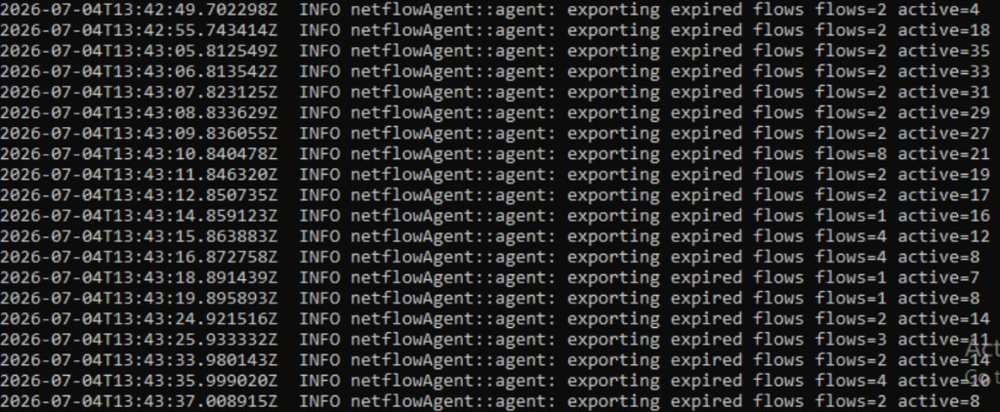
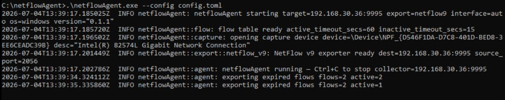

= netflowAgent — проект и план разработки
:toc: left
:toclevels: 3
:sectnums:
:author: netflowAgent
:revdate: 2026-07-06

== Роли

[cols="1,2", options="header"]
|===
| Роль | Кто

| Разработка (код, архитектура)
| AI + репозиторий

| Тестирование, corp-среда, обратная связь
| Вы (отдельная Windows VM + Ubuntu-коллектор)

|===

== Цель

Агент на **конечных хостах** (Windows / Linux), который:

. захватывает сетевой трафик локального интерфейса;
. агрегирует его в flow-записи;
. экспортирует **NetFlow v9** (MVP) → позже **IPFIX**;
. отправляет UDP на **nfcapd** коллектора (nfsen-ng).

[[versions]]
== Версии (скачивание)

[cols="1,1,2,1", options="header"]
|===
| Версия | Статус | Содержимое | Git

| **v0.1.1**
| **стабильная** (откат)
| Ручной запуск из cmd, NetFlow v9; проверена сутками на win-pc01
| тег `v0.1.1`

| **v0.2.0**
| старая (Windows only)
| Служба + ps1
| тег `v0.2.0`

| **v0.3.1**
| **текущая** (IPFIX + TCP flags)
| Исправленный IPFIX template 259; абсолютное время; оба endpoint
| до приёмочного теста — ветка `main`

| **v0.3.0**
| ошибочная для IPFIX
| IPFIX template 258: неверные IE и относительное время; NetFlow v9 не затронут
| тег `v0.3.0`

| **v0.2.2**
| стабильная (откат NetFlow v9 без flags)
| win-pc01 + ubuntu-pc01
| тег `v0.2.2`

| **v0.1.1**
| откат (Windows, ручной cmd)
| Без службы
| тег `v0.1.1`

|===

[IMPORTANT]
====
*v0.3.1* — исправленный IPFIX + TCP flags на **обоих** endpoint. Откат без flags: тег `v0.2.2`.

* `format = "netflow9"` — NetFlow v9 template 258 (+ TCP_FLAGS)
* `format = "ipfix"` — IPFIX template 259 (IANA IE, абсолютные timestamps; nfcapd принимает оба формата)

Windows: link:netflowAgent-install-windows.adoc[install-windows]. Linux: link:netflowAgent-install-linux.adoc[install-linux].
====

Скачать с GitHub:

[source,bash]
----
# v0.3.1 до создания проверенного тега
git clone https://github.com/kolixxx/nflowCapAgent.git

# откат v0.2.2 (NetFlow v9 без flags)
git clone --depth 1 --branch v0.2.2 https://github.com/kolixxx/nflowCapAgent.git
----

== Связь с коллектором

См. link:nfsen-ng-install-ubuntu2404.adoc[Установка nfsen-ng], link:logs-cheatsheet.adoc[Памятка: логи и диагностика].

Установка агента на endpoint:

* link:netflowAgent-install-windows.adoc[Windows — Npcap + агент + служба (win-pc01)]
* link:netflowAgent-install-linux.adoc[Linux — libpcap + агент (ubuntu-pc01)]

[cols="1,1,1,1", options="header"]
|===
| Хост | Порт UDP | Папка nfcapd | NFSEN_SOURCES

| win-pc01 (Windows VM)
| 9995
| `live/win-pc01/`
| `win-pc01`

| ubuntu-pc01 (Linux endpoint)
| 9996
| `live/ubuntu-pc01/`
| `ubuntu-pc01`

|===

Агент на каждой машине настраивается только через `config.toml` (`collector.host`, `collector.port`).

== Архитектурные решения (зафиксировано)

[cols="1,2", options="header"]
|===
| Решение | Выбор

| Язык
| **Rust** — один проект, две сборки

| Агентов
| **Один** код; различия только OS-слой (capture, service, installer)

| Portable
| **Нет** — ручная установка на Windows (Npcap + 3 шага); Linux: systemd / install.sh

| MVP протокол
| **NetFlow v9** → <<этап-3,этап 3 IPFIX>>

| Windows захват
| **Npcap** — link:netflowAgent-install-windows.adoc#шаг-1-установка-npcap[ручная установка]

| Linux захват
| **libpcap**

| Тест Windows
| **Windows Server 2019 x64** (основной); Win10 client — позже

| Распространение Windows
| **`netflowAgent.exe`** + `config.toml` + `install-service.ps1`; инструкция link:netflowAgent-install-windows.adoc[install-windows]

| GitHub (целевой)
| https://github.com/kolixxx/nflowCapAgent.git

|===

== Windows: совместимость и требования

=== Win10 и Win10 Server — один и тот же агент?

**Да**, для тестов и продакшена используем **один** `netflowAgent.exe` (64-bit):

[cols="1,1,1", options="header"]
|===
| ОС | Поддержка | Примечание

| Windows 10 (Pro / Enterprise / Education)
| ✅
| Основная цель тестирования

| Windows Server 2016 / 2019 / 2022
| ✅
| Тот же NT 10.0, те же API (Npcap, службы)

| Windows 11
| ✅ (ожидаемо)
| Тот же exe x64, отдельная проверка позже

| Windows 7 / 8.1
| ❌
| Не планируется

| 32-bit (x86)
| ❌
| Только **x64**

| Windows ARM64
| ❌ (пока)
| Отдельная сборка — только если понадобится

|===

Ядро агента, Npcap и Windows Service работают одинаково на **клиентской** и **серверной** Windows одного поколения. Отдельный «Server-агент» не нужен.

=== Минимальные требования (тестовая VM)

[cols="1,2", options="header"]
|===
| Параметр | Минимум / рекомендация

| ОС
| Windows 10 x64 **или** Windows Server 2016+ x64

| Версия Win10
| 1809 (сборка 17763) и новее — комфортно; 1607+ теоретически возможно

| RAM
| **2 GB** минимум; **4 GB** комфортно для VM + браузер

| CPU
| **1 vCPU** достаточно; 2 vCPU если VM тормозит

| Диск
| **20 GB** системный том (ОС + Npcap + логи); сам агент < 10 MB

| Сеть
| Доступ к коллектору `192.168.30.36`, UDP **9995** (и общий LAN с Ubuntu)

| Права
| **Локальный администратор** (установка Npcap, служба, захват пакетов)

| Доп. ПО на чистой Windows
| **Npcap** — см. link:netflowAgent-install-windows.adoc#шаг-1-установка-npcap[установка Npcap]; **VC++ Redistributable 2015–2022** x64 (часто уже есть в Windows Update)

| Не нужно
| Rust, Perl, Python, .NET, Wireshark

|===

=== Нагрузка агента (ожидание)

Агент лёгкий: типично **десятки MB RAM**, немного CPU при обычном трафике рабочей станции. Для лабораторного теста хватит **самой скромной Win10 VM** в Hyper-V / VMware / VirtualBox.

=== Что проверить после установки VM

* [ ] `winver` — Windows 10 x64
* [ ] `ping 192.168.30.36`
* [ ] Запуск `netflowAgent.exe` **от имени администратора**
* [ ] Npcap установлен — link:netflowAgent-install-windows.adoc[инструкция Windows]

[source,text]
----
netflowAgent_win-linux/          ← локальная папка (Cursor / OneDrive)
  docs/
  agent/
----

Код пока **только на вашем диске** — в GitHub ещё не залит. Публикация: репозиторий
https://github.com/kolixxx/nflowCapAgent.git (когда скажете — настроим `git remote` и push).

== Структура репозитория (целевая)

[source,text]
----
netflowAgent_win-linux/
  docs/
    nfsen-ng-install-ubuntu2404.adoc
    netflowAgent-design.adoc          ← этот файл
  agent/                              ← Rust-проект
    Cargo.toml
    config.example.toml
    src/
      main.rs
      config.rs
      capture/                        # OS-specific packet capture
      flow/                           # flow table, timeouts
      export/                         # NetFlow v9, позже IPFIX
      service/                        # Windows Service / systemd
----

== Поток данных

[source,text]
----
  NIC (Windows VM / Linux)
        │
        ▼
   capture (Npcap / libpcap)
        │
        ▼
   flow table (5-tuple, bytes, packets, timestamps)
        │
        ▼
   export NetFlow v9 (UDP datagrams)
        │
        ▼
   nfcapd на Ubuntu-коллекторе (:9995 / :9996)
        │
        ▼
   nfsen-ng (графики, Flows, Statistics)
----

[[agent-log]]
== Лог netflowAgent

Полная памятка по всей цепочке (агент + nfcapd + nfsen-ng): link:logs-cheatsheet.adoc[logs-cheatsheet.adoc].

=== Куда пишется

[cols="1,2,2", options="header"]
|===
| Режим | Куда | Путь по умолчанию

| Ручной запуск (cmd)
| stdout (консоль)
| —

| Служба Windows (этап 2+)
| файл из config
| `C:\ProgramData\netflowAgent\agent.log`

| Linux systemd (позже)
| файл + journald
| `/var/log/netflowAgent/agent.log`

|===

Уровень — `logging.level` в config (по умолчанию `info`). Если задан `logging.file`, события **дублируются** в файл (и в консоль при ручном запуске).

=== Стартовые строки (один раз)

[cols="1,2", options="header"]
|===
| Сообщение | Значение

| `netflowAgent starting`
| Старт; поля `target` (IP:port коллектора), `export=netflow9`, `interface`, `version`

| `flow table ready`
| Таблица flow готова; `active_timeout_secs` / `inactive_timeout_secs` из config

| `opening capture device`
| Npcap открыл интерфейс (`device`, `desc` — имя адаптера)

| `NetFlow v9 exporter ready`
| UDP-сокет готов; `dest` — коллектор, `source_port=2056`

| `netflowAgent running — Ctrl+C to stop`
| Основной цикл захвата и экспорта; остановка — Ctrl+C

|===

См. скриншот: <<запуск-агента,Запуск агента>>.

=== `exporting expired flows` (каждую ~1 секунду при трафике)

.Экспорт flow-записей на коллектор (нормальная работа)

Пример строки:

[source,text]
----
2026-07-04T13:43:05.702298Z  INFO netflowAgent::agent: exporting expired flows  flows=2  active=35
----

[cols="1,2", options="header"]
|===
| Поле | Значение

| `2026-07-04T13:43:05.702298Z`
| Время события в **UTC** (суффикс `Z`). Для MSK: **+3 часа**

| `INFO`
| Информационное сообщение (не ошибка)

| `exporting expired flows`
| Агент отправил на коллектор пакет NetFlow v9 с **завершёнными** flow

| `flows=2`
| В этом UDP-пакете **2 flow-записи** (две «сессии», которые только что истекли)

| `active=35`
| Сейчас в таблице **35 активных** flow (ещё идёт трафик, не экспортированы)

|===

==== Что такое один flow

Один **flow** — одно агрегированное соединение по **5-tuple**:

* IP источника и назначения
* порты (TCP/UDP)
* протокол (6 = TCP, 17 = UDP)
* счётчики байт и пакетов за время жизни

Агент **не** логирует каждый пакет — только **сводки** по соединениям.

==== Жизненный цикл flow

[source,text]
----
  пакеты с NIC → flow table (observe)
                      │
         ┌────────────┴────────────┐
         │  active (ещё трафик)    │
         └────────────┬────────────┘
                      │ нет пакетов inactive_timeout_secs (15 с)
                      │ или дольше active_timeout_secs (60 с)
                      ▼
                 expired → NetFlow v9 → UDP :9995 → nfcapd
----

* **active** — соединение ещё «живое», пакеты приходят.
* **expired** — тишина 15 с (или максимум 60 с) → flow закрывается в таблице и **экспортируется**.
* Раз в **~1 с** агент проверяет таблицу; если есть expired — пишет `exporting expired flows` и шлёт UDP.

[TIP]
====
*Много строк* `exporting expired flows` с `flows=10…50` — **нормально** при активном браузере, ping, RDP и т.д.
*Нет строк* минутами — на интерфейсе мало трафика или агент не захватывает (Npcap, права admin).
====

=== Прочие сообщения

[cols="1,2", options="header"]
|===
| Сообщение | Значение

| `export failed`
| **ERROR** — UDP на коллектор не ушёл (сеть, firewall); flow из этого цикла могли не дойти

| `capture read error`
| **WARN** — сбой чтения Npcap; часто временный

| `config OK`
| Режим `--check-config`: config.toml корректен

|===

== Конфигурация (`config.toml`)

Пример для **win-pc01**:

[source,toml]
----
[collector]
host = "192.168.30.36"   # Ubuntu-коллектор (kolix)
port = 9995

[export]
format = "netflow9"      # MVP; позже "ipfix"
observation_domain_id = 1
source_id = 1

[capture]
interface = "auto"       # или имя: "Ethernet", "eth0"
promiscuous = false

[flow]
active_timeout_secs = 60
inactive_timeout_secs = 15

[logging]
level = "info"
file = "C:\\ProgramData\\netflowAgent\\agent.log"   # Windows
# file = "/var/log/netflowAgent/agent.log"          # Linux
----

== Этапы разработки

=== Этап 0 — скелет

* [x] Документ проектирования
* [x] Структура Rust-проекта, парсинг config
* [x] Сборка на Windows (release x64)

=== Этап 1 — MVP «пульс» ✅ принят (2026-07-04)

* [x] Захват пакетов с интерфейса (Npcap)
* [x] Flow table (IPv4 TCP/UDP)
* [x] Экспорт NetFlow v9 на коллектор (UDP, source port 2056)
* [x] CLI: `--check-config`, `--list-devices`
* [x] Запуск вручную от администратора
* [x] Приёмка: файлы на коллекторе, Flows/Graphs в nfsen-ng (`edge` + TZ), auto-import за ночь

[NOTE]
====
Логи в файл и Windows Service — <<этап-2,этап 2>>. В Flows колонки First/Last могут быть в UTC (−3 ч от MSK) — см. link:nfsen-ng-install-ubuntu2404.adoc#flows-table-utc[nfsen-ng doc].
====

**Критерий приёмки (выполнено):**

[source,bash]
----
find /var/nfdump/profiles-data/live/win-pc01 -name "nfcapd.*" -ls
# nfsen-ng → Graphs / Flows → win-pc01
----

=== Этап 1.5 — полировка v0.1.1 ✅

* [x] NetFlow v9: 4-byte counters + INPUT/OUTPUT SNMP (template 257, меньше INVALID)
* [x] Логи в консоли Windows без ANSI (`with_ansi(false)` на Windows)
* [x] `config.example.toml`: `interface = "auto"` по умолчанию
* [x] Сборка → `agent/dist/win-x64/` → GitHub

*Тестер:* заменить exe на VM, прогнать 30 мин; в `nfdump -c 10` проверить, что `Event: INVALID` нет или реже.

[[этап-2]]
=== Этап 2 — сервис и установка

==== 2a. Windows Service + лог в файл — v0.2.0 ✅ принят (2026-07-06)

* [x] Логи в файл (`config.toml` → `logging.file`); при ручном запуске — консоль + файл
* [x] Windows Service (`netflowAgent`), автозапуск, reboot
* [x] CLI: `--install-service`, `--uninstall-service`, `--run-as-service`
* [x] Скрипты: `install-service.ps1`, `uninstall-service.ps1` (`New-Service`)
* [x] Памятка по логам: link:logs-cheatsheet.adoc[logs-cheatsheet.adoc]
* [x] Инструкция: link:netflowAgent-install-windows.adoc[install-windows]
* [x] Тест: служба, uninstall/reinstall, reboot, график `win-pc01`

[[решение-без-установщика-windows]]
==== Решение: без setup.exe на Windows

Установка сводится к **трём действиям**: Npcap → скопировать `exe` + `config` + ps1 → `install-service.ps1`. Отдельный MSI/setup *не делаем* — усложнение без выгоды для corp-развёртывания.

Полная инструкция: link:netflowAgent-install-windows.adoc[netflowAgent-install-windows.adoc].

==== Установка службы (кратко)

. Скопировать `netflowAgent.exe` **v0.2.0** и `config.toml` в `C:\netflowAgent\`
. В `config.toml` задать `[logging] file = "C:\\ProgramData\\netflowAgent\\agent.log"`
. PowerShell **от администратора** — скрипт `install-service.ps1` (через `New-Service`, не `sc.exe`):

[source,powershell]
----
cd C:\netflowAgent
.\netflowAgent.exe --check-config --config config.toml
.\install-service.ps1
----

Альтернатива без скрипта:

[source,powershell]
----
.\netflowAgent.exe --install-service --config config.toml
sc start netflowAgent
----

. Проверка:

[source,powershell]
----
Get-Service netflowAgent
Get-Content C:\ProgramData\netflowAgent\agent.log -Tail 20
----

. Удаление службы: `C:\netflowAgent\uninstall-service.ps1` или `.\netflowAgent.exe --uninstall-service`

==== 2b. Linux endpoint — v0.2.2 ✅ принят (2026-07-06)

* [x] Сборка на Linux (`scripts/build-linux.sh`)
* [x] systemd unit + `install-linux.sh` / `uninstall-linux.sh`
* [x] config для `ubuntu-pc01` → порт **9996**
* [x] Документация: link:netflowAgent-install-linux.adoc[install-linux] (Ubuntu 18.04)
* [x] `interface = auto` → `ens160` (и аналоги)
* [x] Тест: график `ubuntu-pc01`, nfdump INVALID=0, reboot OK

*Вместе с Windows v0.2.0 → релиз <<versions,v0.2.2>> (NetFlow v9 на обоих endpoint).*

[[этап-3]]
=== Этап 3 — IPFIX и TCP flags — v0.3.1

* [x] **TCP flags** — cumulative OR по пакетам TCP (NetFlow IE 6 / IPFIX tcpControlBits)
* [x] **IPFIX export** — `format = "ipfix"` в config
* [x] NetFlow v9 template **258** (+ TCP_FLAGS)
* [x] IPFIX template **259**: IANA IE, `flowStart/EndMilliseconds`, padding, sequence по Data Records
* [ ] Тест на обоих endpoint + nfdump/nfsen-ng
* [ ] IPv6 flows (далее)
* [ ] Фильтры захвата в config
* [ ] Перезагрузка config без переустановки (SIGHUP / API)

==== TCP flags

Агент **до v0.3.0 не собирал** TCP flags — только 5-tuple, байты и пакеты. В v0.3.0 flags появились, но IPFIX template был ошибочным; для IPFIX использовать v0.3.1+.

С **v0.3.0**: для каждого TCP-пакета читается байт flags (offset 13 заголовка TCP); в flow — **побитовое OR** всех пакетов (стандарт NetFlow/nfdump: `flags` в extended output).

UDP: `tcp_flags = 0`.

Проверка после экспорта:

[source,bash]
----
nfdump -R .../live/win-pc01 -c 10 -o extended | grep -E 'flags|Flags'
----

== План работ (порядок)

[cols="1,1,2,2", options="header"]
|===
| # | Кто | Задача | Результат

| **1**
| AI
| ~~Этап 1.5: v0.1.1~~ ✅
| `netflowAgent.exe` v0.1.1 на GitHub

| **2**
| Вы
| ~~Тест v0.1.1~~ ✅ принят (2026-07-06)
| INVALID=0, график за сутки

| **3**
| Вы
| ~~Тест v0.2.0: служба + reboot + uninstall~~ ✅ (2026-07-06)
| Windows win-pc01 стабилен

| **4**
| AI
| ~~Этап 2a: Windows~~ ✅ v0.2.0
| install-windows.adoc, без setup.exe

| 5
| AI
| ~~Этап 2b: Linux~~ ✅ v0.2.2
| build-linux.sh, install-linux.sh

| 6
| Вы
| ~~Тест Ubuntu 18.04 + оба графика~~ ✅ (2026-07-06)
| win-pc01 + ubuntu-pc01 в nfsen-ng

| 7
| AI
| <<этап-3,Этап 3>>: IPFIX (приоритет), затем IPv6
| `format = "ipfix"` в config

| 8
| AI / Вы
| IPv6, фильтры, hot-reload config
| по необходимости

|===

[IMPORTANT]
====
Между этапами коллектор (*nfcapd* + *nfsen-ng*) *не трогаем* — уже настроен. Меняется только агент на endpoint-хостах.
====

**Сборка (разработчик, Windows):**

[source,powershell]
----
cd agent
cargo build --release
# exe: target/release/netflowAgent.exe
# или: agent/dist/win-x64/
----

== Чеклист тестера (Этап 1)

=== Перед тестом

Полная инструкция: link:netflowAgent-install-windows.adoc[Установка на Windows].

* [ ] Коллектор: nfcapd на :9995, nfsen-ng работает
* [ ] Известен IP коллектора
* [ ] Windows VM: Npcap установлен — link:netflowAgent-install-windows.adoc#шаг-1-установка-npcap[шаг 1]
* [ ] В `config.toml`: правильные `host` и `port`

[[запуск-агента-checklist]]
=== Запуск агента

Скопируйте на Windows VM папку `agent/dist/win-x64/` (см. link:netflowAgent-install-windows.adoc[install-windows]).

. Npcap — link:netflowAgent-install-windows.adoc#шаг-1-установка-npcap[шаг 1 install-windows]
. Отредактируйте `config.toml`: `collector.host`, `capture.interface` (см. ниже).
. **От имени администратора** в cmd или PowerShell:

[source,cmd]
----
cd C:\netflowAgent
.\netflowAgent.exe --list-devices
.\netflowAgent.exe --check-config
.\netflowAgent.exe --config config.toml
----

[[запуск-агента]]
.Успешный запуск netflowAgent v0.1.1 (Windows Server 2019, `interface = "auto"`)

В консоли должны быть строки:

* `version=0.1.1`, `interface=auto`
* `opening capture device` — Intel 82574L (или ваш адаптер)
* `NetFlow v9 exporter ready` → `192.168.30.36:9995`
* `netflowAgent running — Ctrl+C to stop`
* периодически: `exporting expired flows` — см. <<agent-log,Лог netflowAgent>>

[NOTE]
====
С `interface = "auto"` имя `\Device\NPF_{GUID}` подставляется автоматически. Если нужен конкретный адаптер — укажите его из `--list-devices`.
====

* [ ] `netflowAgent.exe --config config.toml` от администратора
* [ ] В консоли: как на скриншоте выше
* [ ] С Windows VM: открыть сайты, ping, несколько минут трафика

=== Проверка на коллекторе

* [ ] `find .../live/win-pc01/.../nfcapd.*` — файлы появились
* [ ] nfsen-ng → Initial Import
* [ ] График `win-pc01` не пустой

=== Если не работает

[cols="1,2", options="header"]
|===
| Симптом | Куда смотреть

| Агент не стартует
| Лог агента; Npcap; права admin

| Агент работает, файлов нет на коллекторе
| IP/порт; firewall corp; `ss -ulnp` на коллекторе

| Файлы есть, UI пустой
| `NFSEN_SOURCES=win-pc01`; Initial Import

|===

== Статус тестового окружения

[cols="1,2", options="header"]
|===
| Параметр | Значение

| IP коллектора (Ubuntu + nfsen-ng)
| `192.168.30.36`

| Windows VM (тест)
| **Windows Server 2019 x64**

| Win10 client
| позже, не приоритет

| Ping VM → `192.168.30.36`
| ✅ проходит

| Сетевой интерфейс (Win Server 2019)
| `Ethernet0` (Intel 82574L)

| UDP 9995 → коллектор
| ✅ работает

| nfsen-ng Graphs / auto-import
| ✅ проверено (ночной прогон)

| Этап 1
| ✅ принят 2026-07-04

| Следующий шаг
| Тест v0.1.1 → этап 2 (Service)

| Агент (текущий)
| v0.1.1 — `agent/dist/win-x64/netflowAgent.exe`

| Rust на Windows VM
| не нужен — раздаём собранный `netflowAgent.exe`

|===

== Вопросы к тестеру (напоминания)

* [x] Windows Server 2019 x64 в сети с коллектором
* [x] `ping 192.168.30.36` — OK
* [x] Интерфейс: `Ethernet0` (`Get-NetAdapter`)
* [x] Npcap установлен
* [x] Первый запуск `netflowAgent.exe` от администратора
* [x] Графики win-pc01 обновляются автоматически

== Ссылки

* link:https://github.com/kolixxx/nflowCapAgent[nflowCapAgent на GitHub]

* link:https://github.com/phaag/nfdump[nfdump / nfcapd]
* link:https://github.com/mbolli/nfsen-ng[nfsen-ng]
* link:https://npcap.com/[Npcap]
