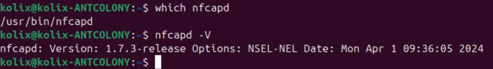

= Установка nfsen-ng на Ubuntu 24.04 (Docker)
:toc: left
:toclevels: 3
:sectnums:
:icons: font
:source-highlighter: highlight.js
:experimental:
:author: netflowAgent
:revdate: 2026-07-01

== Назначение документа

Пошаговая инструкция по развёртыванию link:https://github.com/mbolli/nfsen-ng[nfsen-ng] на чистой *Ubuntu 24.04 LTS* (Server или Desktop) через *Docker*.

Документ рассчитан на сценарий, когда NetFlow/IPFIX поступает *с конечных хостов* (Windows/Ubuntu-агенты), а не с сетевого оборудования. Коллектор и веб-интерфейс — на одном Linux-сервере.

== Архитектура

[source,text]
----
  win-pc01 (Perl-агент)  ──IPFIX UDP :9995──►  nfcapd → live/win-pc01/
  ubuntu-pc01 (агент)    ──IPFIX UDP :9996──►  nfcapd → live/ubuntu-pc01/
                              │
                              ▼
                    nfsen-ng (Docker) → браузер :9000
----

[IMPORTANT]
====
* *nfsen-ng не принимает NetFlow/IPFIX по сети* — это только визуализатор поверх nfdump.
* *nfcapd обязателен на коллекторе* — он принимает UDP-поток и пишет файлы `nfcapd.*`.
* На endpoint-хостах nfcapd *не нужен* — только агент, отправляющий flow на коллектор.
====

=== Компоненты

[cols="1,2,2", options="header"]
|===
| Компонент | Где работает | Роль

| Perl-агент (ваш проект)
| Windows / Ubuntu endpoint
| Сбор трафика, экспорт IPFIX по UDP

| `nfcapd`
| Ubuntu-коллектор (хост, не Docker)
| Приём flow, запись в `/var/nfdump/profiles-data/live/<source>/`

| `nfsen-ng`
| Ubuntu-коллектор (Docker)
| Графики (RRD), Flows/Statistics через nfdump, веб-UI

|===

== Требования

=== Сервер (коллектор)

* Ubuntu 24.04 LTS (чистая установка)
* 2 vCPU, 4 GB RAM (минимум для лаборатории)
* 40+ GB диск (растёт с объёмом flow-данных)
* Сеть: статический или DHCP IP, доступный агентам по UDP

=== Порты

[cols="1,1,2", options="header"]
|===
| Порт | Протокол | Назначение

| 9995 (и др.)
| UDP
| Приём NetFlow/IPFIX (`nfcapd`)

| 9000
| TCP
| Веб-интерфейс nfsen-ng (HTTP)

|===

== Шаг 1. Подготовка системы

Откройте терминал и выполните:

[source,bash]
----
sudo apt update && sudo apt upgrade -y
sudo apt install -y curl git ca-certificates nano
----

Узнайте IP сервера (понадобится для настройки агентов):

[source,bash]
----
ip -4 addr show
----

== Шаг 2. Установка Docker

[source,bash]
----
curl -fsSL https://get.docker.com | sudo sh
sudo usermod -aG docker $USER
----

[IMPORTANT]
====
После `usermod` выполните *полную перезагрузку* системы (`sudo reboot`). Закрытия терминала или блокировки экрана недостаточно — группа `docker` подхватывается только в новой сессии входа.

После reboot проверьте:

[source,bash]
----
groups
# в списке должна быть docker
----
====

Проверка:

[source,bash]
----
docker --version
docker compose version
docker run --rm hello-world
----

== Шаг 3. Установка nfcapd (коллектор flow)

[source,bash]
----
sudo apt install -y nfdump
which nfcapd
nfcapd -V
----

.Nfcapd version

=== Каталоги и источники (win-pc01 + ubuntu-pc01)

[IMPORTANT]
====
* *Каталог сам по себе ничего не собирает* — `mkdir` только создаёт место на диске.
* *nfcapd* принимает UDP и *пишет* файлы в каталог из `-w`.
* *nfsen-ng* только *читает* каталоги, перечисленные в `NFSEN_SOURCES`; flow туда не перенаправляет.

Один UDP-порт = один процесс `nfcapd`. Чтобы разделить два хоста в UI, каждому — свой порт и своя папка под `live/`.
====

В проекте netflowAgent — *два конечных устройства*:

[cols="1,1,1,2", options="header"]
|===
| Хост | UDP-порт на коллекторе | Каталог на диске | Имя в nfsen-ng

| win-pc01
| 9995
| `/var/nfdump/profiles-data/live/win-pc01/`
| `win-pc01`

| ubuntu-pc01
| 9996
| `/var/nfdump/profiles-data/live/ubuntu-pc01/`
| `ubuntu-pc01`

|===

Создайте каталоги:

[source,bash]
----
sudo mkdir -p /var/nfdump/profiles-data/live/{win-pc01,ubuntu-pc01}
----

=== Запуск nfcapd (два источника)

[source,bash]
----
sudo nfcapd -w /var/nfdump/profiles-data/live/win-pc01    -z=lz4 -S 1 -p 9995 -D
sudo nfcapd -w /var/nfdump/profiles-data/live/ubuntu-pc01 -z=lz4 -S 1 -p 9996 -D
----

[cols="1,3", options="header"]
|===
| Флаг | Значение

| `-w`
| Каталог записи; путь `.../live/<source>` задаёт имя источника

| `-S 1`
| Структура `YYYY/MM/DD/` — *обязательно* для nfsen-ng

| `-z=lz4`
| Сжатие capture-файлов

| `-p 9995`
| UDP-порт приёма NetFlow/IPFIX

| `-D`
| Запуск в фоне (daemon)

|===

[NOTE]
====
В nfcapd 1.7.x флаг `-T all` *устарел* (`Option -T no longer supported and ignored`). В командах выше его нет — расширения flow захватываются по умолчанию.
====

[TIP]
====
Папка `live/all` в этой схеме *не используется*. Если все агенты шлют на один порт, flow смешивается в одном каталоге — для двух хостов так делать не нужно.
====

=== Firewall (ufw)

На *Ubuntu Desktop* `ufw` часто *выключен* по умолчанию — тогда порты на VM уже доступны из LAN (если их не блокирует корпоративный firewall).

Сначала проверьте статус:

[source,bash]
----
sudo ufw status verbose
# или кратко:
sudo ufw status
----

[cols="1,2", options="header"]
|===
| Вывод | Что делать

| `Status: inactive`
| *Ничего не обязательно.* UDP 9995/9996 и TCP 9000 не фильтруются ufw. Переходите к docker-compose. Правила ниже — только если решите включить ufw позже.

| `Status: active`
| Добавьте правила *до* или *после* enable — см. ниже.

|===

Если ufw *активен* или вы хотите его включить:

[source,bash]
----
sudo ufw allow 9995/udp   # win-pc01
sudo ufw allow 9996/udp   # ubuntu-pc01
sudo ufw allow 9000/tcp   # nfsen-ng UI
sudo ufw enable           # только если ufw был inactive и вы сознательно включаете его
sudo ufw status numbered
----

[WARNING]
====
`sudo ufw enable` на машине с `inactive` *включает* firewall и начинает блокировать всё, что не разрешено явно (по умолчанию deny incoming). Не запускайте `enable`, если ufw выключен и вас устраивает текущее поведение.
====

[TIP]
====
Корпоративный межсетевой экран между endpoint и VM ufw не заменяет — даже при `inactive` на Ubuntu трафик может блокироваться *вне* вашей VM.
====

=== Проверка приёма данных (необязательно на этом этапе)

[NOTE]
====
*Perl-агенты netflowAgent на этом шаге **не нужны**.* Достаточно того, что `nfcapd` слушает порты 9995 и 9996 (проверка через `ss -ulnp`).

Пустые каталоги `live/win-pc01/` и `live/ubuntu-pc01/` — *нормально*. Файлы `nfcapd.*` появятся только когда:

* заработают ваши агенты (win-pc01 → :9995, ubuntu-pc01 → :9996), или
* вы временно проверите приём через <<тест-softflowd,softflowd>> на самой VM.

*Сейчас можно переходить к шагу 4* (docker-compose / nfsen-ng). Initial Import в UI имеет смысл после появления хотя бы одного flow-файла.
====

Когда агенты (или softflowd) уже шлют данные — подождите 5–10 минут (ротация файлов) и выполните:

[source,bash]
----
find /var/nfdump/profiles-data/live/win-pc01 -name "nfcapd.*" -ls
find /var/nfdump/profiles-data/live/ubuntu-pc01 -name "nfcapd.*" -ls
----

== Шаг 4. Загрузка и настройка docker-compose

[source,bash]
----
mkdir -p ~/nfsen-ng && cd ~/nfsen-ng
curl -O https://raw.githubusercontent.com/mbolli/nfsen-ng/master/deploy/docker-compose.yml
nano docker-compose.yml
----

=== Обязательные изменения в `docker-compose.yml`

==== 1. Тег Docker-образа (важно)

В compose-файле по умолчанию указан `image: ghcr.io/mbolli/nfsen-ng:latest`, но тег **`latest` на GHCR сейчас отсутствует** (он появляется только у стабильных релизов без `-RC`). Замените строку `image`:

[source,yaml]
----
    image: ghcr.io/mbolli/nfsen-ng:1.0.0-RC.1
----

Альтернатива — последняя сборка с master:

[source,yaml]
----
    image: ghcr.io/mbolli/nfsen-ng:edge
----

[NOTE]
====
Если `docker compose pull` выдаёт `not found` для `:latest` — причина именно в теге. После смены на `1.0.0-RC.1` или `edge` pull заработает.
====

==== 2. Удалить переопределение `entrypoint` (важно)

В compose-файле с GitHub есть строка:

[source,yaml]
----
    entrypoint: ["/bin/bash", "/var/www/html/nfsen-ng/deploy/docker-entrypoint.sh"]
----

В образе GHCR (`1.0.0-RC.1`, `edge`) каталог `deploy/` *не копируется* — скрипт лежит в `/usr/local/bin/docker-entrypoint.sh` и уже прописан в образе. Переопределение из compose ломает запуск:

[source,text]
----
docker-entrypoint.sh: No such file or directory
exited with code 127
Restarting...
----

*Закомментируйте или удалите* всю строку `entrypoint:` у сервиса `nfsen`:

[source,yaml]
----
    # entrypoint: ["/bin/bash", "/var/www/html/nfsen-ng/deploy/docker-entrypoint.sh"]
----

==== 3. Открыть порт веб-интерфейса

Раскомментируйте блок `ports` у сервиса `nfsen`:

[source,yaml]
----
    ports:
      - "9000:9000"
----

Без этого веб-UI доступен только внутри Docker-сети.

==== 4. Указать источники (имена папок под `live/`)

Для двух endpoint-хостов:

[source,yaml]
----
      - NFSEN_SOURCES=win-pc01,ubuntu-pc01
----

[WARNING]
====
Значение `NFSEN_SOURCES` *должно совпадать* с именами каталогов:
`/var/nfdump/profiles-data/live/<имя>/`
====

==== 5. Порты для графиков RRD

[source,yaml]
----
      - NFSEN_PORTS=80,443,22,53
----

Список TCP/UDP-портов, по которым nfsen-ng строит отдельные RRD-графики.

==== 6. Часовой пояс (рекомендуется)

[source,yaml]
----
      - TZ=Europe/Moscow
----

Если `nfcapd` на хосте работает в том же часовом поясе, что и контейнер, переменная `NFCAPD_TZ` не нужна. Если nfcapd в локальном времени хоста, а контейнер в UTC — добавьте:

[source,yaml]
----
      # - NFCAPD_TZ=Europe/Moscow
----

=== Что можно не менять

[source,yaml]
----
    volumes:
      - /var/nfdump/profiles-data:/data/nfsen-ng
      - NFSEN_NFDUMP_PROFILES=/data/nfsen-ng
----

`NFSEN_NFDUMP_PROFILES` — путь *внутри контейнера*; volume связывает его с `/var/nfdump/profiles-data` на хосте.

=== Файл `settings.php`

Для стандартной установки *не требуется*. Достаточно переменных окружения в `docker-compose.yml`. Файл настроек нужен только для сложных сценариев (много фильтров, VictoriaMetrics и т.д.).

=== Пример минимального фрагмента `environment`

[source,yaml]
----
    environment:
      - TZ=Europe/Moscow
      - NFSEN_SOURCES=win-pc01,ubuntu-pc01
      - NFSEN_PORTS=80,443,22,53
      - NFSEN_NFDUMP_BINARY=/usr/local/nfdump/bin/nfdump
      - NFSEN_NFDUMP_PROFILES=/data/nfsen-ng
      - NFSEN_LOG_LEVEL=INFO (Раскомментируйте)
----

== Шаг 5. Запуск nfsen-ng

[source,bash]
----
cd ~/nfsen-ng
# убедитесь, что в compose указан тег 1.0.0-RC.1 или edge, не latest
docker compose pull
docker compose up -d
----

Проверка:

[source,bash]
----
docker compose ps
docker compose logs -f nfsen
----

Остановка просмотра логов: `Ctrl+C` (контейнер продолжит работать).

Проверка, что контейнер видит файлы nfcapd:

[source,bash]
----
docker exec nfsen-ng ls /data/nfsen-ng/live/win-pc01/
docker exec nfsen-ng ls /data/nfsen-ng/live/ubuntu-pc01/
----

== Шаг 6. Первый вход и импорт данных

. Откройте браузер на сервере или с другого ПК в сети:

[source,text]
----
http://localhost:9000
http://<IP_СЕРВЕРА>:9000
----

. Перейдите на вкладку *Admin*.
. Нажмите *Initial Import* — импорт исторических nfcapd-файлов в RRD.
. Дождитесь завершения (время зависит от объёма данных).

[TIP]
====
На вкладке Admin также доступен *Health check*: версия nfdump, пути к данным, статус daemon.
====

== Шаг 7. Автозапуск nfcapd (systemd)

Для двух источников создайте два unit-файла.

*win-pc01* — `/etc/systemd/system/nfcapd-win-pc01.service`:

[source,ini]
----
[Unit]
Description=nfcapd collector for win-pc01
After=network.target

[Service]
Type=forking
ExecStartPre=/bin/mkdir -p /var/nfdump/profiles-data/live/win-pc01
ExecStart=/usr/bin/nfcapd -w /var/nfdump/profiles-data/live/win-pc01 -z=lz4 -S 1 -p 9995 -D
Restart=on-failure

[Install]
WantedBy=multi-user.target
----

*ubuntu-pc01* — `/etc/systemd/system/nfcapd-ubuntu-pc01.service`:

[source,ini]
----
[Unit]
Description=nfcapd collector for ubuntu-pc01
After=network.target

[Service]
Type=forking
ExecStartPre=/bin/mkdir -p /var/nfdump/profiles-data/live/ubuntu-pc01
ExecStart=/usr/bin/nfcapd -w /var/nfdump/profiles-data/live/ubuntu-pc01 -z=lz4 -S 1 -p 9996 -D
Restart=on-failure

[Install]
WantedBy=multi-user.target
----

Включите оба сервиса:

[source,bash]
----
sudo systemctl daemon-reload
sudo systemctl enable --now nfcapd-win-pc01.service nfcapd-ubuntu-pc01.service
sudo systemctl status nfcapd-win-pc01.service nfcapd-ubuntu-pc01.service
----

Контейнер nfsen-ng уже имеет `restart: unless-stopped` в compose — перезапускается вместе с Docker.

== Шаг 8. Настройка endpoint-агентов (netflowAgent)

Perl-агент на каждом хосте отправляет IPFIX на коллектор. IP сервера — из шага 1 (`ip -4 addr`).

[cols="1,1,1,1", options="header"]
|===
| Хост | IP коллектора | UDP-порт | Каталог на коллекторе

| win-pc01
| `<IP_коллектора>`
| 9995
| `live/win-pc01/`

| ubuntu-pc01
| `<IP_коллектора>`
| 9996
| `live/ubuntu-pc01/`

|===

[WARNING]
====
Порт в агенте *должен совпадать* с портом `nfcapd` для этого хоста. Иначе данные попадут не в ту папку или не попадут вообще.
====

`nfcapd` принимает NetFlow v5/v9 и IPFIX. После появления flow-файлов nfsen-ng подхватит данные при следующем импорте или через встроенный import daemon.

== Режим с HTTPS (опционально)

Для продакшена с доменом и Let's Encrypt используется профиль `proxy` и Caddy:

[source,bash]
----
curl -O https://raw.githubusercontent.com/mbolli/nfsen-ng/master/deploy/Caddyfile.prod
nano Caddyfile.prod   # замените yourdomain.com на свой домен
docker compose --profile proxy up -d
----

Для лаборатории на одном ПК без домена достаточно `http://<IP>:9000` — Caddy не нужен.

== Устранение неполадок

[cols="1,2", options="header"]
|===
| Симптом | Решение

| Пустые графики
| Нет файлов nfcapd → проверьте агенты, firewall, `find ... nfcapd.*`

| Источник не виден в UI
| `NFSEN_SOURCES` не совпадает с именем папки `live/<source>`

| `http://IP:9000` не открывается
| Раскомментируйте `ports: "9000:9000"`, проверьте `ufw`

| `docker compose pull`: `latest: not found`
| Замените `image: ...:latest` на `:1.0.0-RC.1` или `:edge`

| Контейнер `Restarting (127)`, `docker-entrypoint.sh: No such file`
| Закомментируйте строку `entrypoint:` в compose (см. шаг 4.2)

| `permission denied` при Docker
| Выполните `sudo reboot` после `usermod -aG docker`; проверьте `groups`

| Время на графиках сдвинуто
| Выровняйте `TZ` и при необходимости `NFCAPD_TZ`

| SSE / графики не обновляются
| Не сжимайте прокси-трафик к nfsen-ng; для Caddy см. wiki nfsen-ng

|===

=== Полезные команды

[source,bash]
----
# Логи nfsen-ng
docker compose -f ~/nfsen-ng/docker-compose.yml logs -f nfsen

# Перезапуск
cd ~/nfsen-ng && docker compose restart

# Полный переимпорт RRD (осторожно — удалит текущие RRD)
# В docker-compose.yml временно:
#   - NFSEN_FORCE_IMPORT=true
# затем docker compose up -d и уберите переменную после первого запуска

# Статус nfcapd
sudo systemctl status nfcapd
----

== Чеклист перед запуском

* [ ] Ubuntu 24.04 обновлена
* [ ] Docker и Docker Compose установлены
* [ ] Два `nfcapd` слушают UDP 9995 и 9996 (`ss -ulnp`)
* [ ] Каталоги `live/win-pc01/` и `live/ubuntu-pc01/` созданы
* [ ] ufw: проверен статус; правила — только если `active`
* [ ] В `docker-compose.yml`: `NFSEN_SOURCES=win-pc01,ubuntu-pc01`, порт `9000:9000`
* [ ] `docker compose up -d` выполнен успешно
* [ ] *(позже, когда будут агенты)* flow-файлы в каталогах, Initial Import в Admin
* [ ] *(позже)* win-pc01 → :9995, ubuntu-pc01 → :9996

== Ссылки

* link:https://github.com/mbolli/nfsen-ng[nfsen-ng на GitHub]
* link:https://github.com/mbolli/nfsen-ng/wiki/Installation[Wiki: Installation]
* link:https://github.com/mbolli/nfsen-ng/wiki/Configuration[Wiki: Configuration]
* link:https://github.com/phaag/nfdump[nfdump / nfcapd]

[[тест-softflowd]]
== Приложение: тест через softflowd (без Perl-агентов)

Пока агенты netflowAgent не готовы, можно *локально* проверить цепочку «отправка → nfcapd → файлы на диске» на самой VM-коллекторе:

[source,bash]
----
sudo apt install -y softflowd
ip link   # найдите интерфейс, например enp0s3 или wlp2s0

sudo softflowd -i enp0s3 -v 9 -n 127.0.0.1:9996
----

Подставьте свой интерфейс. Через несколько минут проверьте:

[source,bash]
----
find /var/nfdump/profiles-data/live/ubuntu-pc01 -name "nfcapd.*" -ls
----

Затем выполните *Initial Import* в веб-интерфейсе nfsen-ng.
